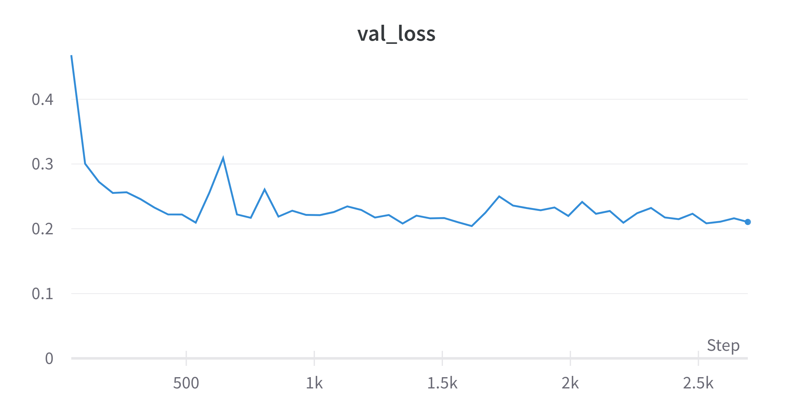

## Unet++

## CE-Net

### Conf 0

| Optimizer | Loss            | LR     | Batch size |
| --------- | --------------- |:------:|:----------:|
| Adam      | BCE with Logits | 0.0001 | 4          |

CE-NEt con questa configurazione **non imparava**. La loss era molto bassa ma l'output (durante training e validation) era sempre un' immagine completamente nera, ciò è dovuto probabilmente alla struttura delle groud truth: essendo prevalentemente nere con una porzione di foreground molto piccola rispetto al background, il modello imparava che una predizione in cui tutti i pixel sono classificati come "background" fosse una buona predizione. A questo si aggiunge il tipo di loss usata, probabilmente non adatta al modello in questione. 

- Test IoU: 0

### Conf 1

| Optimizer | Loss     | LR     | Batch size |
| --------- | -------- |:------:|:----------:|
| Adam      | DiceLoss | 0.0001 | 4          |

